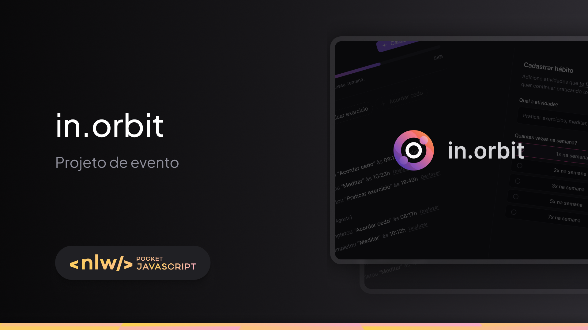

<h1 align="center">NLW Pocket</h1>

  O projeto é um site desktop de registro de metas com progresso semanal.
  Esse é um projeto do evento NLW Pocket Javascript, um dos conteúdos disponíveis para alunos da Rocketseat.

  <a href="#-tecnologias">Tecnologias</a>&nbsp;&nbsp;&nbsp;|&nbsp;&nbsp;&nbsp;
  <a href="#-projeto">Projeto</a>&nbsp;&nbsp;&nbsp;|&nbsp;&nbsp;&nbsp;
  <a href="#-layout">Layout</a>&nbsp;&nbsp;&nbsp;|&nbsp;&nbsp;&nbsp;
  <a href="#-como-executar">Como executar</a>&nbsp;&nbsp;&nbsp;|&nbsp;&nbsp;&nbsp;
  <a href="#-agradecimentos">Agradecimentos</a>

  

## ✨ Tecnologias

Esse projeto foi desenvolvido com as seguintes tecnologias e monorepo com [turbo](https://turbo.build/):
- [Web 🌐](./web):
  - [Vite](https://vitejs.dev/)
  - [React](https://reactjs.org)
  - [TypeScript](https://www.typescriptlang.org/)
  - [Tailwindcss](https://tailwindcss.com/)
  - [TanStack Query](https://tanstack.com/query/latest)
- [Server 💻](./server):
  - [Node.js](https://nodejs.org/en/)
  - [TypeScript](https://www.typescriptlang.org/)
  - [Drizzle ORM](https://orm.drizzle.team/)
  - [Fastify](https://fastify.dev/)
  - [Docker](https://www.docker.com/)

## 💻 Projeto

Explore um aplicativo JavaScript full-stack criado com Node.js, React e PostgreSQL. Este projeto se concentra na criação de um rastreador de hábitos robusto, seguindo os princípios SOLID para garantir um código limpo, modular e escalável. Utilize design patterns para resolver problemas comuns e otimizar a arquitetura do sistema. Aprenda conceitos avançados, como consultas SQL, gerenciamento de estado e visualização de dados. Contribua para um projeto que prioriza código limpo, manutenibilidade e melhores práticas.

## 🔖 Layout

Você pode visualizar o layout do projeto através [desse link](https://www.figma.com/community/file/1415093862269754302/nlw-pocket-js-in-orbit). É necessário ter conta no [Figma](http://figma.com/) para acessá-lo.

## 🚀 Como executar

- Clone o repositório
- Instale as dependências com `pnpm install`
- E rode as migrations com `pnpm run db:migration`
- E se quiser popular o bando de dados rode `pnpm run db:seed`
- Inicie o servidor em modo desenvolvedor `pnpm run dev`
- Faça a build do projeto `pnpm run build`
- Iniciar o projeto `pnpm start`

Agora você pode acessar web [`localhost:3000`](http://localhost:5173/) e o server [`localhost:3333/api`](http://localhost:3333/)

## 💜 Agradecimentos

- [Rocketseat](https://www.rocketseat.com.br/)
- [Notion](https://docs-rocketseat.notion.site/FullStack-Intermedi-rio-Node-React-b2382e372d1f44f6bfb51a3d7b723dfd)
- [Layout](https://www.figma.com/community/file/1415093862269754302/nlw-pocket-js-in-orbit)

---

Feito com ❤️‍🔥 by Elivelton Santos 👋🏻